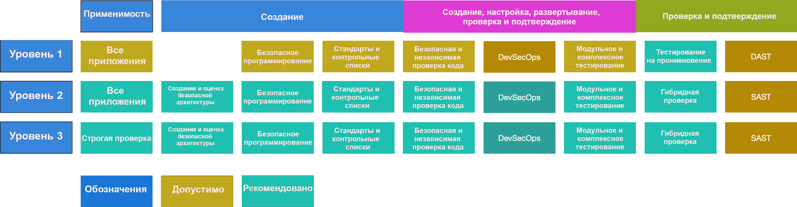

# Использование ASVS

ASVS ставит перед собой две основных цели:

* помочь организациям в разработке и поддержке безопасных приложений;
* уменьшить разницу между предложениями поставщиков средств обеспечения безопасности и ожиданиями потребителей.

## Уровни подтверждения безопасности приложений

Стандарт ASVS выделяет три уровня подтверждения безопасности — чем выше уровень, тем глубже анализ.

* Уровень 1 — для подтверждения простых требований, подходит для тестирования на проникновение.
* Уровень 2 — для приложений, которые содержат важные данные, требующие защиты; рекомендуется для большинства приложений.
* Уровень 3 — для критически важных приложений, использующихся для передачи или хранения конфиденциальных данных (например, медицинских), а также для приложений, требующих наивысший уровень надежности.

Для каждого уровня ASVS имеется список требований к безопасности. Каждое требование может включать в себя несколько компонентов обеспечения безопасности, которые разработчики должны реализовать в программе.

Рисунок 1. Уровни стандарта подтверждения безопасности приложений OWASP версии 4.0

Уровень 1 — это единственный уровень, соответствие которому можно проверить тестированием на проникновение. Для всех остальных уровней требуется обращение к документации, исходному коду, параметрам настройки и разработчикам. Тестирование методом "черного ящика" (при отсутствии документации и исходного кода) является неэффективным, и от него стоит отказаться. Злоумышленники не имеют ограничений по времени на поиск уязвимостей, а на проведение пентестов отводится, как правило, несколько недель. Специалисты должны обеспечивать безопасность, находить и устранять недостатки, а также обнаруживать атаки и реагировать на них в течение определенного срока. У злоумышленников нет сроков, им требуется найти всего один недостаток в защите или возможность оставаться незамеченными, чтобы достигнуть намеченной цели. Тестирование методом "черного ящика", проводимое в сжатые сроки в конце разработки или не проводимое вообще, нельзя противопоставлять потенциальным угрозам.

За последние тридцать с лишним лет тестирование методом "черного ящика" не позволило обнаружить большое количество критически важных уязвимостей, которые привели к серьезным последствиям. Мы настоятельно рекомендуем использовать весь спектр проверок и методов подтверждения безопасности, заменить обычное тестирование на проникновение гибридным для исходного кода, а также обращаться к разработчикам и документации на протяжении всего цикла разработки. Финансовые регуляторы не любят внешних аудитов без доступа к журналам, транзакциям или людям, контролирующим соответствующие операции. Промышленность и правительства должны требовать такой же прозрачности в сфере разработки ПО.

Мы также рекомендуем использовать средства обеспечения безопасности в рамкам самого процесса разработки. Такие инструменты, как DAST и SAST, используемые на протяжении всего цикла создания приложения, позволяют обнаружить очевидные проблемы с безопасностью.

Автоматизированные инструменты и онлайн-сканирование не способны проверить больше половины требований ASVS без участия человека. Если для каждой сборки требуются сложные автоматизированные проверки, то применяются специальные модульные и комплексные тесты, а также онлайн-сканирование после сборки. Тестирование бизнес-логики и контроля доступа возможно только при участии человека. Все это должно входить в модульное и комплексное тестирование.

## Как пользоваться стандартом

Один из лучших способов применения стандарта подтверждения безопасности приложений — это его использование в качестве шаблона для создания контрольного списка безопасного программирования, подходящего для вашего приложения, платформы или организации. Изменение ASVS в соответствии с вашими сценариями использования поможет акцентировать внимание на требованиях, наиболее важных для ваших проектов и окружения.

### Уровень 1. Первые шаги: автоматизация или общий анализ

Приложение достигает 1-го уровня ASVS, если обеспечивает защиту от уязвимостей из топ-10 OWASP и других подобных списков.

Уровень 1 — это минимум, к которому должны стремиться все приложения. Он подходит для сложных процессов в качестве начального этапа, а также для приложений, которые не хранят или не обрабатывают критически важные данные и поэтому не требуют соответствия более строгим требованиям 2-го или 3-го уровня. Параметры 1-го уровня можно проверять автоматически или вручную без доступа к исходному коду. Мы считаем 1-й уровень обязательным для всех приложений.

Предполагается, что злоумышленники будут искать очевидные и простые в эксплуатации уязвимости, а не будут тратить силы и время на детальный анализ приложения. Если данные, обрабатываемые вашим приложением, имеют большую ценность, то не стоит ограничиваться 1-м уровнем.

### Уровень 2. Большинство приложений

Приложение достигает 2-го (стандартного) уровня ASVS, если обеспечивает защиту от большинства рисков, связанных с современным программным обеспечением.

Уровень 2 гарантирует наличие в приложении средств обеспечения безопасности и их эффективность. Он подходит для приложений, отвечающих за важные транзакции между организациями, обрабатывающих медицинские данные, выполняющих критически значимые операции, работающих с критически важными активами, а также для отраслей, где целостность (защита от модификаций) является критически важной для бизнеса (например, борьба с читерами и мошенничеством в индустрии игр).

Предполагается, что злоумышленники, атакующие приложения 2-го уровня, — это квалифицированные, действующие целенаправленно специалисты, которые используют проверенные инструменты и методы, позволяющие эффективно обнаруживать и эксплуатировать недостатки в приложениях.

### Уровень 3. Повышенная ценность, надежность или безопасность

Уровень 3 — это максимальный уровень стандарта подтверждения безопасности приложений (ASVS). Он предназначен для приложений, к которым предъявляются повышенные требования безопасности. Такие приложения обычно используются в силовых структурах, здравоохранении или критически важных инфраструктурах.

В организациях 3-й уровень ASVS может применяться к приложениям, выполняющим критически важные операции, сбой в работе которых может привести к серьезным последствиям для организации. Ниже представлен пример приложения 3-го уровня. Приложение достигает 3-го (продвинутого) уровня, если обеспечивает защиту от комплексных уязвимостей и имеет хорошо спроектированную систему безопасности.

Третий уровень ASVS предполагает более тщательные анализ, структурирование, программирование и тестирование приложения, по сравнению с другими уровнями. Безопасное приложение должно быть модульным: это позволяет обеспечить устойчивость, масштабируемость и многоуровневую защиту. Каждый модуль, отделенный сетевым подключением и (или) физическим устройством, имеет свою зону ответственности (эшелонированная защита), которая должна быть задокументирована соответствующим образом. В зону ответственности входит обеспечение конфиденциальности (например, с помощью шифрования), целостности (например, через проверку транзакций и вводимых данных), доступности (например, путем грамотного распределения нагрузки), аутентификации (включая межсистемную), неподдельности, авторизации и аудита (журналирования).

## Применение ASVS на практике

Каждая угроза обусловлена своими факторами. В каждой отрасли имеются свои уникальные данные и технологии, а также специфические требования к обеспечению безопасности.

Организациям рекомендуется детально изучить потенциальные риски, характерные для их бизнеса, и выбрать для себя соответствующий уровень ASVS.
